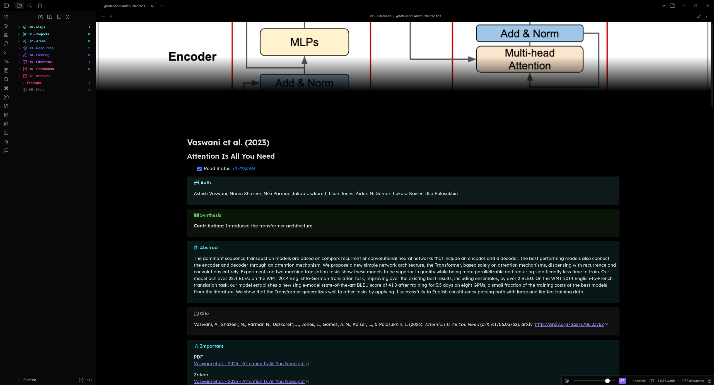
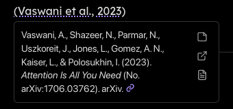
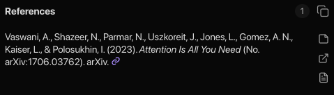
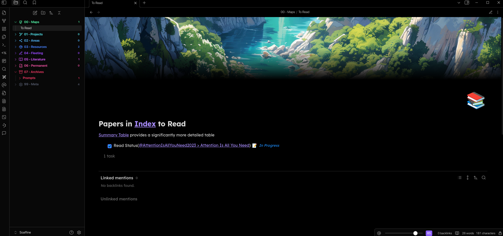
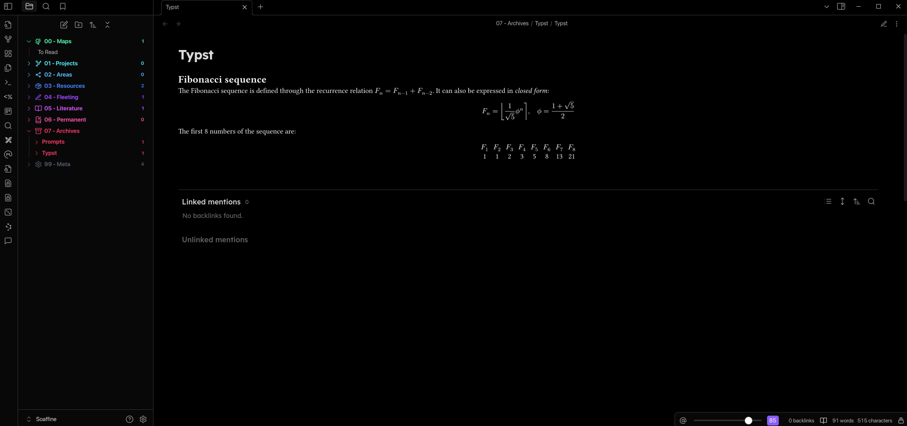
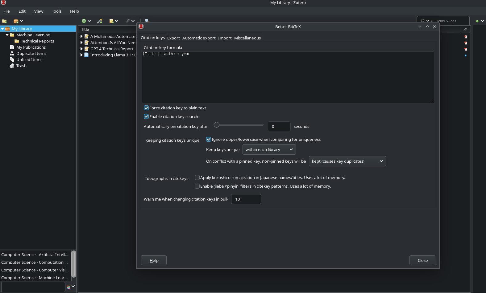

# Soaffine Obsidian Vault

## Features

### Zotero Compatibility

Easily import [Zotero](https://www.zotero.org/) items to your Obsidian vault.

Automatically generate [Zettelkasten](https://zettelkasten.de/overview/)
[literature notes](https://writing.bobdoto.computer/what-is-a-literature-note/)
and [Pandoc references.](https://pandoc.org/)

Pandoc references in permanent notes helpfully automatically find the literature
note.



 

### Automatic Reading Lists

Automatically keep track of reading progress, with a list of items from
literature notes



### Typst Compilation

Full [typst](https://typst.app/) support, [generates embedded PNGs and SVGs from
typst codeblocks](https://github.com/fenjalien/obsidian-typst) instantly.



<details>
  <summary>Text version of the code example.</summary>

```typst
= Fibonacci sequence
The Fibonacci sequence is defined through the
recurrence relation $F_n = F_(n-1) + F_(n-2)$.
It can also be expressed in _closed form:_

$ F_n = round(1 / sqrt(5) phi.alt^n), quad
  phi.alt = (1 + sqrt(5)) / 2 $

#let count = 8
#let nums = range(1, count + 1)
#let fib(n) = (
  if n <= 2 { 1 }
  else { fib(n - 1) + fib(n - 2) }
)

The first #count numbers of the sequence are:

#align(center, table(
  columns: count,
  ..nums.map(n => $F_#n$),
  ..nums.map(n => str(fib(n))),
))
```

</details>

### More

- Integrate with [Omnivore](https://github.com/omnivore-app/omnivore)
- [Talk to notes](https://github.com/brianpetro/obsidian-smart-connections) with [OpenRouter](https://openrouter.ai/),
[Anthropic](https://www.anthropic.com/api),
or [OpenAI](https://platform.openai.com)
- [Encrypt Notes](https://github.com/meld-cp/obsidian-encrypt)
- [Custom Callouts](https://github.com/javalent/admonitions)
- [Embeddable Charts](https://github.com/phibr0/obsidian-charts)
- [Manage with Kanban](https://github.com/mgmeyers/obsidian-kanban)
- [Make Drawings](https://github.com/zsviczian/obsidian-excalidraw-plugin)
- [Automatic Table of Contents](https://github.com/johansatge/obsidian-automatic-table-of-contents)
- Query data, lint markdown, replace typographical characters, set reminders,
manage tasks, refactor notes, automatically pull link metadata, set banners, set
icons

## Pre-requisites

### 1. Install Obsidian

<details>
  <summary>Install with home-manager:</summary>

```nix
{
  pkgs,
  ...
}:
{
  home.packages = builtins.attrValues { inherit (pkgs) obsidian obsidian-export; };
}
```

</details>

### 2. Install Zotero

<details>
  <summary>Install with home-manager:</summary>

```nix
{
  pkgs,
  ...
}:
{
  home.packages = builtins.attrValues { inherit (pkgs) zotero; };
}
```

</details>

### 3. Overlay NUR onto nixpkgs, and allow unfree packages

<details>
  <summary>Overlay:</summary>

```nix

inputs = {
  nixos-unstable = {
    url = "github:NixOS/nixpkgs/nixos-unstable";
  };
  nixpkgs.follows = "nixos-unstable";
  nur.url = "github:nix-community/NUR";
};

...
(import inputs.nixpkgs {
  inherit system;
  config.allowUnfree = true;
  overlays = [ inputs.nur.overlay ];
})
...
```

</details>

### 4. Install Zotero-Connector in Firefox

<details>
  <summary>Install with home-manager:</summary>

```nix
{
  pkgs,
  ...
}:
{
  programs = {
    firefox = {
      enable = true;
      profiles = {
        default = {
          id = 0;
          extensions = builtins.attrValues {
            inherit (pkgs.nur.repos.rycee.firefox-addons)
              zotero-connector
              ;
          };
        };
      };
    };
  };
}
```

</details>

### 5. Install Better BibTeX for Zotero

This needs to be done [manually currently.](https://retorque.re/zotero-better-bibtex/installation/)

Once installed, consider changing the [generated citation key formula.](https://retorque.re/zotero-better-bibtex/citing/)

<details>
  <summary>Change settings in Zotero:</summary>

I recommend setting the "Citation key formula" to `(Title || auth) + year`.



</details>

## Useful Commands

- `Ctrl+P > Zotero Integration: Create Literature Note` - If Zotero is open,
will provide a selector. Selected library item will add a note to
`05 - Literature`
- `Ctrl+P > Zotero Integration: Pandoc` - If Zotero is open, will provide a
selector. Selected library item will add a Pandoc citation similar to
`[@AttentionIsAllYouNeed2023]`
- `Ctrl+P > Banner: Paste banner from clipboard` - If the clipboard contains an
image link, will add as a banner to the top of the note.
